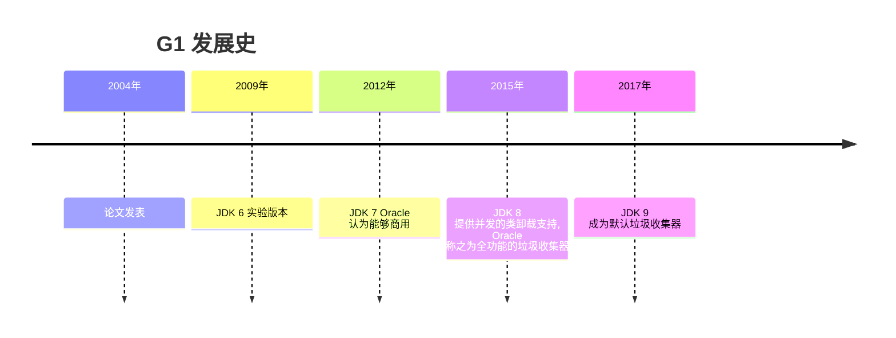
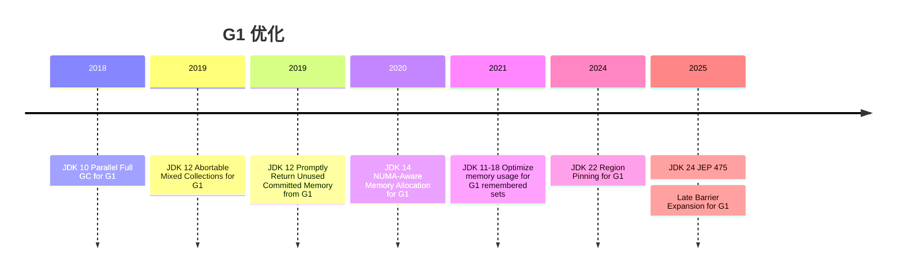

 G1 是垃圾收集器技术发展史上的里程碑式的成果，开创了收集器面向局部收集的设计思路和基于 Region 的内存布局形式。G1 最早是在 2004 年 David Detlefs 等人的论文 Garbage-First Garbage Collection 中提出。自从 在 2009 年 3 月 JDK 6 Update 14 引入 Early Access 版本，15 年来 G1 的性能和功能得到巨大的提升和完善。本文将从源码级别介绍 region 、 card、记忆集、卡表、线程缓冲区、写屏障以及 G1 的收集阶段。

> Java 历史版本: [Java/Java SE: All Releases, End of Life, Release Date](https://versionlog.com/java/)


## G1 发展历史





### 垃圾收集算法衡量指标

在 JVM 中负责管理应用堆内存的组件叫做垃圾收集器（garbage collector，简称 GC）。GC 管理着内存的分配和释放，具体来说管理着堆对象的整个生命周期。JVM 垃圾收集器的基础功是：

1.  根据应用程序的要求尽快地分配内存。
2.  高效率地检测应用程序已经不需要的内存进行回收。

对于优秀的垃圾收集算法有很多要求，有三点是需要重点讨论的，分别是 `throughput`、`latency`、`Memory footprint`。虽然有很多实现方式满足以上要求，但是某一种算法只能在某一个方面达到最优秀。基于此，JDK 提供了多种垃圾回收算法来应对不同的业务场景。

1.  `Throughput` 表示在单位时间内所在的工作量，更多的工作量意味着更高的 throughput。
2.  `Latency`意味着单个操作所花费的时间，具体来说是垃圾收集期间 stop the world 的时间。
3.  `Memory footprint` 说的是垃圾收集需要的内存，比如与垃圾收集相关的数据结构，统计数据。

上述三个指标是相互联系的：更高的 throughput 会导致高 latency ，反之亦然，更低的 latency 会降低 throughput。而更低的 Memory footprint 的算法可能使得其他二者的指标变得更差。

理想的垃圾回收算法是更高的 throughput，更低的 lantency， 更低的 footprint。

<image src="/assets/gc-important-component/gc-alg-tri.png" width="50%" title=""/>

### 垃圾收集器

针对不同的场景， JDK 21 提供五种不同类型垃圾收集器。

| Garbage Collector                        | Focus Area                 | Concepts                                                                       |
| ---------------------------------------- | -------------------------- | ------------------------------------------------------------------------------ |
| Parallel                                 | Throughput                 | Multithreaded stop-the-world (STW) compaction and generational collection      |
| Garbage First (G1)                       | Balanced performance       | Multithreaded STW compaction, concurrent liveness, and generational collection |
| Z Garbage Collector (ZGC) (since JDK 15) | Latency                    | Everything concurrent to the application                                       |
| Shenandoah (since JDK 12)                | Latency                    | Everything concurrent to the application                                       |
| Serial                                   | Footprint and startup time | Single-threaded STW compaction and generational collection                     |

Parallel GC 是 JDK 8 及以前版本的默认垃圾收集器。它聚焦于 throughput 的最大化而稍微降低对 latency 的要求。

G1 从 JDK 9 开始成为默认垃圾收集器，它试图平衡 throughput 和 lantency 。

ZGC 和 Shenandoah GC 专注于低 lantency。ZGC 在 JDK 11 中引入，JDK 15 中达到生产可用，后续版本中逐渐增强，在 JDK 21 中加入分代收集功能 [ZGC history](https://wiki.openjdk.org/display/zgc)。Shenandoah GC 在 JDK 12 中开始引入，后续被下放到之前版的版本，根据 [Shenandoah history](https://wiki.openjdk.org/display/shenandoah)，Shenandoah GC 在 JDK 8 及以后的长期支持版均可用，有望在 JDK 24 引入分代收集功能。

Serial GC 专注于 footprint 和 startup time，是单线程版的 Parallel GC。

> 在 throughput 优先的情况下，Parallel GC 比 G1 和 ZGC 都要好，见 [How fast is Java 21](https://timefold.ai/blog/java-21-performance)。

## G1 重要概念

### 堆划分

G1 是一个分代、增量收集、并行、大多数时间并发、少量停顿用户线程收集器，它能最大限度的满足用户设置的最大停顿时间。G1 是默认的垃圾收集器，也可以用 `-XX:+UseG1GC` 开启。使用参数 `-XX:MaxGCPauseMillis` 设置最大停顿时间，默认为 200 ms。

### Java 堆内存总体结构

<image src="/assets/gc-important-component/heap-divide.png" width="60%" title=""/>

G1 通过参数`-Xmx` 和 `-Xms` 设置最大最小堆内存。

G1 是分代收集器，将堆分成年轻代和老年代，年轻代的大小通过`-XX:G1NewSizePercent` 和 `-XX:G1MaxNewSizePercent` 来设置，前者默认值为 5，后者默认值为 60。意味着年轻代大小占总的堆大小为 5% ~ 60%，G1 会根据情况动态调整年轻代大小以满足最大停顿时间。

### region

G1 开创了基于 region 的内存布局，如图所示，G1 将连续的堆内存分成多个大小相等的独立区域（Region），每个 Region 都可以根据需要扮演新生代或者老年代空间。Region 的大小通过 -XX:G1HeapRegionSize 指定，取值范围为 1MB ～ 32 MB，且应为 2 的 N 次幂。

<image src="/assets/gc-important-component/region.png" width="60%" title=""/>

> 注意：`-XX:NewSize` 和 `-XX:MaxNewSize`同样能设置新生大小，如果只有一个参数被设置值，那么新生代就会被固定为这个值，会影响暂停时间的控制。

JDK 18 突破了 region 最大内存 32MB 的限制，最大可以达到 512 M。下面是源码中对 region 大小的定义：

```cpp
//src/hotspot/share/gc/g1/heapRegionBounds.hpp
static const size_t MIN_REGION_SIZE = 1024 * 1024; //1M
static const size_t MAX_ERGONOMICS_SIZE = 32 * 1024 * 1024; // 32M，G1 自动调节的最大值
static const size_t MAX_REGION_SIZE = 512 * 1024 * 1024; //512 Mb
```

>细节请参考： [G1: Refactor remembered sets](https://bugs.openjdk.org/browse/JDK-8017163) 和 [8275056: Virtualize G1CardSet containers over heap region](https://github.com/openjdk/jdk/commit/1830b8da9028af430ee4791f310b5fc9cb1ff37d#diff-05a26063eefdc656c3ec8d13940777799a58f17cfdec601f6143785c3b78a5efR40)。

### card

为了更好的管理内存，Java 将 Region 划分成多个 card，每个 card 是 512（2^9） 字节，G1 很多操作是以 card 为颗粒度管理的。

<image src = "/assets/gc-important-component/card.png" width="60%" title=""/>

> G1 可以通过对象的地址，计算出对象所处的 region 和 card。

### 记忆集

G1 利用记忆集（Remembered Sets）解决分代收集和部分收集的问题，具体来说用于记录非收集区域指向收集区域的指针集合的抽象数据结构。由于 young GC（回收新生代） 和 mixed GC（回收新生代和部分老年代）都会回收整个新生代，那么记忆集只需要记录两类跨区域指针。

1.  老年代到新生代的指针。
2.  老年代到老年代的指针。

<image src = "/assets/gc-important-component/rset3.png" width="80%" title=""/> 

如图，r1的记忆集记应该是{ (r6,[c12])}，r6的记忆集记应该是 {(r7,[c14])}。

> 实际记录的是索引，是整数。
> 假设 card size 为 512 kb，实际为 512 bytes。

<image src = "/assets/gc-important-component/rset1.png" width="70%" title=""/> 

如上图，存在 R<sub>1</sub> 中 C card 指向 R<sub>0</sub> A card，那么在 R<sub>0</sub> 的记忆集就会记录下类似 {(R<sub>1</sub>，[C])}。

> 实际上是 card C 中的对象指向 card A 中 的对象，但是记忆集记录的是 card。

当 R<sub>0</sub> 被回收时，存活的对象被转移（G1 称为 evacuate）到 R<sub>2 </sub>，并且更新对应的记忆集。

<image src = "/assets/gc-important-component/rset2.png" width="70%" title=""/>

记忆集在 G1 中扮演了非常重要的角色，是实现部分收集的关键技术，深入源码有助于我们深入理解其实现原理。

#### JDK 18 之前

在 G1 中每个 region 都有一个记忆集（后面简称 rset），每个 rset 根据记录信息的数量和颗粒度分成三个容器。从记录数量的从少到多、信息颗粒度从细到粗、遍历记忆集速度从快到慢分成 `_sparse_table`、`_fine_grain_regions`、`_coarse_map`。如果使用 Java 中数据结构对比理解，那么三个容器分别对应于 ` HashMap<Integer, List<Integer>>()` 、`new HashMap<Integer, BitMap>()`、`BitMap`。

```cpp
// HeapRegion -> HeapRegionRemSet* _rem_set -> OtherRegionsTable _other_regions
class OtherRegionsTable VALUE_OBJ_CLASS_SPEC {
  BitMap      _coarse_map; 
  PerRegionTable** _fine_grain_regions;
  SparsePRT   _sparse_table;
}
```

其中 `SparsePRT` 的实现导致 region 最大只能为 32 M，`typedef uint16_t card_elem_t` 导致 card 索引最大为 2^16-1，即 region 中包含 card 最大数量 2^16 个，Region 的最大内存为 2^16 * 2^9 = 2^25 = 32MB。（2^9 = 512 byte， 是 card 的大小）

```cpp
class SparsePRTEntry: public CHeapObj<mtGC> {
  typedef uint16_t card_elem_t;
  card_elem_t _cards[card_array_alignment];
}
```

rset 添加的逻辑在 [OtherRegionsTable::add_reference](https://github.com/openjdk/jdk/blob/0b8a0e2b58dbdd5c9553e502212d32c033a5efb5/src/hotspot/share/gc/g1/heapRegionRemSet.cpp#L131)，下面是伪代码：

```cpp
var exist  = find_in(_coarse_map, region_idx, card_idx);
if(exist) return;
 
var exist  = find_in(_fine_grain_regions,region_idx, card_idx);
if(exist) return;
 
var res = add_card_to(_sparse_table,region_idx, card_idx);
if(res == SparsePRT::added) return ;
 
add_card_to_fine_grain_regions_and_transfer(_fine_grain_regions,_sparse_table ,region_idx, card_idx)
```

#### JDK 18

JDK 18 之前存在，rset 存在很多性能方面的问题，特别是内存占用方面。
[G1: Refactor remembered sets](https://bugs.openjdk.org/browse/JDK-8017163) 对问题描述的非常清楚，感兴趣可以认真阅读。文中提到优化之后的 rset 内存占用能减少 25%。

> The problems are that there is nothing between "no card at all" and "sparse" and in particular the difference between the capability to hold entries of "sparse" and "fine". I.e. memory usage difference when exceeding a "sparse" array (holding 128 entries at 32M regions, taking \~256 bytes) to fine that is able to hold 65k entries using 8kB is significant.

其中提到缺少很多 “中间” 容器。

例如：使用 "sparse" 数组存储 32M 大小 region 的 128 个元素（card 索引）需要 256 字节（128 * 2， card index 使用 `uint16_t` 保存）。 如果有更多的元素进来，要升级成 “fine” 容器，则需要8kb（32M/512byte/8bit/1024），存储空间增加了32倍（8kb/256byte）。

```cpp
//G1HeapRegion rem_set  -> G1HeapRegionRemSet _card_set
class G1CardSet : public CHeapObj<mtGCCardSet> {
    G1CardSetHashTable* _table;
}

class G1CardSetHashTable : public CHeapObj<mtGCCardSet> {
  CardSetHash _table;
  CHTScanTask _table_scanner;
}
using CardSetHash = ConcurrentHashTable<G1CardSetHashTableConfig, mtGCCardSet>;
```

reset 整体结构是一个 hashtable，底层使用的是 `ConcurrentHashTable`，为了保证易用性，使用 G1CardSet 对其进行封装。`hashtable` 中 key 存储 region index，value 指向的的是包含 card index 的容器。容器指针的定义是 `void*`。

```java
using ContainerPtr = void*;
static const uintptr_t ContainerInlinePtr      = 0x0;
static const uintptr_t ContainerArrayOfCards   = 0x1;
static const uintptr_t ContainerBitMap         = 0x2;
static const uintptr_t ContainerHowl           = 0x3
```
容器分成四种类型，对应四种标志位，标志位存储在指针中。

> 由于地址是按照 N 字节对齐的，标记位的存储并不影响原地址的正确性。Java 的指针压缩也是利用字节对齐实现的。


容器初始化是 `ContainerInlinePtr` :

```cpp
G1CardSetHashTableValue value(region_idx, G1CardSetInlinePtr());
```

然后依据元素数量升级，注意 `ContainerBitMap` 只有作为嵌套类型在 `ContainerHowl` 才会被使用到。

`ContainerInlinePtr -> ContainerArrayOfCards -> ContainerHowl -> Full`

对于 ContainerBitMap 没有作为直接容器使用，源码注释：

1. ContainerHowl 能够很好的处理 card 存储，相比 ContainerBitMap 无足轻重。
2. 在并发情况下，将 ContainerHowl 转换成 ContainerBitMap 非常困难。

在源码中可以看到升级流程：

```cpp
bool G1CardSet::coarsen_container(ContainerPtr volatile* container_addr, ContainerPtr cur_container,uint card_in_region, bool within_howl) {
  ContainerPtr new_container = nullptr;
  switch (container_type(cur_container)) {
    case ContainerArrayOfCards: {
      //如果当前容器被 ContainerHowl 包含，则升级成 ContainerBitMap，
      //反之则升级成 ContainerHowl
      new_container = create_coarsened_array_of_cards(card_in_region, within_howl);
      break;
    }
    case ContainerBitMap: {
      new_container = FullCardSet;
      break;
    }
    case ContainerInlinePtr: {
      //升级为 ContainerArrayOfCards
      uint8_t* data = allocate_mem_object(ContainerArrayOfCards);
      break;
    }
    case ContainerHowl: {
      new_container = FullCardSet; // anything will do at this point.
      break;
    }
// omit
  }
```

`ContainerHowl` 嵌套容器升级流程代码和上述一样，此时 within_howl 位 true，升级顺序如下:
`Free -> ContainerInlinePtr -> ContainerArrayOfCards -> ContainerBitMap -> Full`

#### ContainerInlinePtr

本文着重说一下 ContainerInlinePtr的结构， 其他容器读者可自行查阅源码。

ContainerInlinePtr 使用 64 位（64位机器）指针存储，最低两位 bit 为 00 表示容器类型。剩下最低三位表示存储 card 的数量，余下的高位存储 card。ContainerInlinePtr 只能存储 3 至 5 个 card 信息。

```cpp
// MSB                                                 LSB
// +------+         +---------------+--------------+-----+
// |unused|   ...   |  card_index1  | card_index0  |SSS00|
// +------+         +---------------+--------------+-----+
```

举个例子，对于 8M 大小的 region，card 的编号从 0 到 16383（8\*1024\*1024/512）。14 个bit才能表示 16383 （2^14-1）。最多能存储 4 个（4\*14 + 5 = 61 bit）。

#### 添加操作

添加操作由函数 `add_reference` 完成，例如函数 `do_oop_work` 会调用它。`add_reference` 实现细节读者可自行查阅。

下面函数参数 p 是指向源对象属性的指针，通过这个指针可以获取源对象属性所在的 region、card，同样可以获取目标对象的所在的 region、 card，体现了指针的强大之处。

```cpp
inline void G1ConcurrentRefineOopClosure::do_oop_work(T* p) {
  T o = RawAccess<MO_RELAXED>::oop_load(p);
  oop obj = CompressedOops::decode_not_null(o);  //目标对象  
   //目标对象的记忆集
  G1HeapRegionRemSet* to_rem_set = _g1h->heap_region_containing(obj)->rem_set();
  
  if (to_rem_set->is_tracked()) {//将源对象添加到目标对象的记忆集中
    to_rem_set->add_reference(p, _worker_id);
  }
}
```

用下面的图表示老年代跨 region 引用，p 是指向某个源对象的属性，此属性又指向目标对象。

<image src = "/assets/gc-important-component/rset4.png" width="70%" title=""/>

#### 遍历操作

在垃圾收集阶段需要对记忆集进行遍历。记忆集遍历时需要借助于 `CHTScanTask _table_scanner` ，并且每次遍历之前都需要调用 `reset_table_scanner` 重置。

```cpp
 //  垃圾收集遍历记忆集传入 at_safepoint 为 true
void G1CardSet::iterate_containers(ContainerPtrClosure* cl, bool at_safepoint) {
  //omit 
    _table->iterate_safepoint(do_value);
}

template <typename SCAN_FUNC>
  void iterate_safepoint(SCAN_FUNC& scan_f) {
    _table_scanner.do_safepoint_scan(scan_f);
  }

void reset_table_scanner(uint claim_size) {
    _table_scanner.set(&_table, claim_size);
  }
```

#### 记忆集的优化

[8336086: G1: Use one G1CardSet instance for all young regions](https://github.com/openjdk/jdk/commit/f536f5ab68235d27e9708674f707bcbff7840730#diff-9de15630db460d66fdee5ec408be02b3275a2fbf32764f9fb2910b0d1bff7e3aR2695) 对 G1 记忆集进行优化，所有年轻代 region 共享一个记忆集，将在 JDK 24 中发布。优化基于两点：

1. 年轻代之间跨 region 引用并不需要记录。
2. GC 时会回收所有年轻代 region。

在堆中申明全局的 G1CardSet 类型的字段 _young_regions_cardset，并且在在堆初始化的时候创建好，当申请一个新的 region 时，将堆中全局的 _young_regions_cardset 赋值给新的 region。


```cpp
class G1CollectedHeap : public CollectedHeap {
    G1CardSet _young_regions_cardset;
}
//堆初始化的时候创建
_young_regions_cardset(card_set_config(), &_young_regions_cardset_mm)

//G1CollectedHeap::set_region_short_lived_locked-> G1HeapRegion::install_group_cardset

void install_group_cardset(G1CardSet* group_cardset) {
  _card_set = group_cardset; // 堆中全局的 `G1CardSet` 赋值给新的 region。
}
```
优化之后的变化

<image src="/assets/gc-important-component/rset-opt1.png" width="70%" title=""/>
<image src="/assets/gc-important-component/rset-opt2.png" width="70%" title=""/>

> 针对老年 region rset 的优化正在进行。

### 全局卡表

全局卡表是一个数组，用于标记 region 某个中 card 是否存在跨 region 指针，如果存在则标记为 dirty。

```cpp
jint G1CollectedHeap::initialize() {
     G1CardTable* ct = new G1CardTable(heap_rs.region());
     _card_table->initialize(cardtable_storage);
 }

class CardTable{
  typedef uint8_t CardValue;
  size_t          _byte_map_size;    // in bytes
  CardValue*      _byte_map;         // the card marking array
  CardValue*      _byte_map_base
}
```

对于指针 `p` 使用下面的方法定位它所处的 card 在 cardTable 中的索引。

```cpp
  CardValue* byte_for(const void* p) const {
    CardValue* result = &_byte_map_base[uintptr_t(p) >> _card_shift];
    return result;
```

可能是由于 heap 的起始地址并不是从 0 开始的，使用 `_byte_map_base` 而不是直接使用 `_byte_map` 是可以减少计算。如果直接使用 `_byte_map` 则代码如下：

```cpp
  CardValue* byte_for(const void* p) const {
    int idx  = uintptr_t(p) >> _card_shift - (uintptr_t(low_bound) >> _card_shift);
    CardValue* result = &_byte_map[idx];
    return result;
```

card table 与 heap 示意图如下：

<image src = "/assets/gc-important-component/heap-ct.png" widt="90%" title=""/>

### 线程缓冲区

在 `thread` 类定义了一块线程本地缓冲区，长度为 344 字节，主要用于优化性能。在 G1 中数据块分成三个部分:

1. `_satb_mark_queue`：在并发标记中，实现 （Snapshot-at-the beginning）算法的队列，用于写前屏障（pre-write）。

2. `_dirty_card_queue` : 用于维护记忆集，写后屏障（post-write）。

3. `_pin_cache`: region 临界区对象计数的线程本地缓存，见前文[解读 JEP 423: Region Pinning for G1](https://yoa1226.github.io/2024/08/01/region-pinning-for-g1.html)。

```cpp
typedef uint64_t GCThreadLocalData[43]; // 344 bytes

class Thread{
  GCThreadLocalData _gc_data;
}

static G1ThreadLocalData* data(Thread* thread) {
  return thread->gc_data<G1ThreadLocalData>();
}

class G1ThreadLocalData {
  SATBMarkQueue _satb_mark_queue;
  G1DirtyCardQueue _dirty_card_queue;
  G1RegionPinCache _pin_cache;
}
```

#### PtrQueue

`PtrQueue` 是上述两个队列的基类，`_buf` 是元素为指针的数组，`_index` 代表上次入队列的位置，`_index ` 从最大容量开始一直减少到零。

```cpp
class PtrQueue {
  // The (byte) index at which an object was last enqueued.  Starts at
  // capacity (in bytes) (indicating an empty buffer) and goes towards zero
  size_t _index;
  void** _buf;
}
```

#### _satb_mark_queue

解读并发标记内容的时候再详细论述。

#### _dirty_card_queue

当发生对象赋值时，如果存在老年代的对象指向年轻代的对象，那么此时就需要更新年轻代 region 的 rset。但是更新并不会立即发生，当前只需要将老年代的指针加入到 `_dirty_card_queue`。

整个过程是：
- Java 线程产生跨 region 的对象赋值 
- 利用写屏障将跨 region 指针加入到线程本地 `_dirty_card_queue` 
- 本地队列满，加入到全局队列 -> refine 线程根据队列信息更新记忆集 
- 垃圾收集线程根据记忆集更新全局卡表
- 垃圾收集线程根据全局卡表扫描回指向回收集（cset）的 所有 region 的 dirty card。

```cpp
void G1BarrierSet::write_ref_field_post_slow(volatile CardValue* byte) {
  //omit
  G1DirtyCardQueue& queue = G1ThreadLocalData::dirty_card_queue(thr);
  G1BarrierSet::dirty_card_queue_set().enqueue(queue, byte);
}

void G1DirtyCardQueueSet::enqueue(G1DirtyCardQueue& queue, volatile CardValue* card_ptr) {
  CardValue* value = const_cast<CardValue*>(card_ptr);
  if (!try_enqueue(queue, value)) {
    handle_zero_index(queue);
    retry_enqueue(queue, value);
  }
}
```

上面代码将跨 region 指针加入到线程本地队列中，当本地队列满时，则将本地队列的全数据添加到全局队列中。

```cpp
//handle_zero_index -> handle_completed_buffer 
enqueue_completed_buffer(new_node); //加入到全局队列中


//refine_completed_buffer_concurrently() -> refine_buffer() -> 
//refine() -> refine_cleaned_cards() -> refine_card_concurrently()
template <class T>
inline void G1ConcurrentRefineOopClosure::do_oop_work(T* p) {
  T o = RawAccess<MO_RELAXED>::oop_load(p);

  if (CompressedOops::is_null(o)) { return; }

  oop obj = CompressedOops::decode_not_null(o);

  if (G1HeapRegion::is_in_same_region(p, obj)) { return; }

  G1HeapRegionRemSet* to_rem_set = _g1h->heap_region_containing(obj)->rem_set();
  if (to_rem_set->is_tracked()) {
    to_rem_set->add_reference(p, _worker_id);
  }
}
```

通常情况下 `Refinement threads` 负责处理全局队列，入口函数是 `refine_completed_buffer_concurrently`，最终调用 `G1ConcurrentRefineOopClosure::do_oop_work` 更新记忆集。

### 写屏障

写屏障（write barriers）分为写前屏障（pre-write）和写后屏障（post-write），前者用于 SATB (Snapshot-at-the beginning) 算法保证并发标记的正确性，后者用于维护记忆集。本小节仅仅讨论写后屏障。

准确来说，写后屏障作用是将跨 region 指针写入到 `_dirty_card_queue`。

对于 Java 代码：

```java
public class PutFieldWriteBarrierTest {
    private Object myfield = new Object();
}
```

生成的字节码指令如下：

```c
Code:
   0: aload_0
   1: invokespecial #1                  // Method java/lang/Object."<init>":()V
   4: aload_0
   5: new           #2                  // class java/lang/Object
   8: dup
   9: invokespecial #1                  // Method java/lang/Object."<init>":()V
   12: putfield      #7                  // Field myField:Ljava/lang/Object;
   15: return

```

接下来我们探索一下 JVM 是如何从 `putfield` 指令到 `write_ref_field_post`。

下面是解释执行字节码指令的关键代码：

```cpp
// jdk/src/hotspot/share/interpreter/zero/bytecodeInterpreter.cpp
// obj是接收者对象，field_offset
 obj->obj_field_put(field_offset, val);
```

在我们的例子中，上面代码中的 `obj` 是 `PutFieldWriteBarrierTest` 的实例，`field_offset` 是属性`myField` 在对象实例中的位置。`val` 是 `new Object()` 。

使用 [jol](https://github.com/openjdk/jol) 可以得到 `PutFieldWriteBarrierTest` 实例对象的内存布局。实例对象共 16 字节，`myField` 从 `offset` 为 12 的位置开始，占四个字节。

> 默认开启指针压缩，对象引用占四个字节。

<image src="/assets/gc-important-component/write-post-barrier-obj-layout.png" title=""/>

#### 深入源码

由于篇幅有限，这里仅展示函数调用，细节需要读者自行阅读源码。

 ```cpp
//-> obj->obj_field_put(field_offset, val);
//-> oopDesc::obj_field_put(int offset, oop value) 
//-> HeapAccess<>::oop_store_at(as_oop(), offset, value);
//-> oop_store_at(oop base, ptrdiff_t offset, T value)
//-> store_at(oop base, ptrdiff_t offset, T value)
//
//->  template <DecoratorSet decorators, typename T>
//    inline static typename EnableIf<
//    !HasDecorator<decorators, AS_RAW>::value>::type
//    store_at(oop base, ptrdiff_t offset, T value)
//
//-> template <DecoratorSet decorators, typename T>
//   struct RuntimeDispatch<decorators, T, BARRIER_STORE_AT>: AllStatic {
//    typedef typename AccessFunction<decorators, T, BARRIER_STORE_AT>::type func_t;
//    static func_t _store_at_func;
//    static inline void store_at(oop base, ptrdiff_t offset, T value) {
//     _store_at_func(base, offset, value);
//   }
//  }
//
RuntimeDispatch<decorators, T, BARRIER_STORE_AT>::_store_at_func = &store_at_init;
 ```

`_store_at_func` 函数定义如下：

```cpp
RuntimeDispatch<decorators, T, BARRIER_STORE_AT>::_store_at_func = &store_at_init;

//-> void RuntimeDispatch<decorators, T, BARRIER_STORE_AT>::store_at_init(oop base, ptrdiff_t offset, T value)
// -> BarrierResolver<decorators, func_t, BARRIER_STORE_AT>::resolve_barrier()
//->  resolve_barrier_rt()
//-> resolve_barrier_gc()
```

函数 `resolve_barrier_gc`  的返回值是：

```cpp
return PostRuntimeDispatch<typename BarrierSet::GetType<BarrierSet::bs_name>::type::AccessBarrier<ds>, barrier_type, ds>::oop_access_barrier; 

//在 G1 中返回的是
//PostRuntimeDispatch<G1BarrierSet::AccessBarrier<ds>,BARRIER_STORE_AT, ds>::oop_access_barrier
```

下面是 `G1BarrierSet::AccessBarrier` 的定义：

```cpp
  // Callbacks for runtime accesses.
template <DecoratorSet decorators, typename BarrierSetT = G1BarrierSet>
class AccessBarrier: public ModRefBarrierSet::AccessBarrier<decorators, BarrierSetT> {
    typedef BarrierSet::AccessBarrier<decorators, BarrierSetT> Raw;
}
```

回到函数 `oop_access_barrier`，从前文已经知道 `GCBarrierType` 是 `G1BarrierSet::AccessBarrier`。

```cpp
template <class GCBarrierType, DecoratorSet decorators>
struct PostRuntimeDispatch<GCBarrierType, BARRIER_STORE_AT, decorators>: public AllStatic {
  static void oop_access_barrier(oop base, ptrdiff_t offset, oop value) {
    GCBarrierType::oop_store_in_heap_at(base, offset, value);
  }
}
```

 `oop_store_in_heap_at` 函数定义在 `G1BarrierSet::AccessBarrier` 的父类 `ModRefBarrierSet::AccessBarrier` 中。下面是最终的调用链：

 ```cpp
template <DecoratorSet decorators, typename BarrierSetT>
class AccessBarrier: public BarrierSet::AccessBarrier<decorators, BarrierSetT> {
  static void oop_store_in_heap_at(oop base, ptrdiff_t offset, oop value) {
    oop_store_in_heap(AccessInternal::oop_field_addr<decorators>(base, offset), value);
  }
}

template <DecoratorSet decorators, typename BarrierSetT>
template <typename T>
inline void ModRefBarrierSet::AccessBarrier<decorators, BarrierSetT>::
oop_store_in_heap(T* addr, oop value) {
  BarrierSetT *bs = barrier_set_cast<BarrierSetT>(barrier_set());
  bs->template write_ref_field_pre<decorators>(addr); //此时 addr 指向的还是旧对象
  Raw::oop_store(addr, value);
  bs->template write_ref_field_post<decorators>(addr);//此时 addr 指向的还是新对象
}

template <DecoratorSet decorators, typename T>
inline void G1BarrierSet::write_ref_field_post(T* field) {
  volatile CardValue* byte = _card_table->byte_for(field);
  if (*byte != G1CardTable::g1_young_card_val()) {
    write_ref_field_post_slow(byte);
  }
}
 ```

同样可以看到写前屏障的原理类似，只是最后写入的是 `_satb_mark_queue`。

## G1 收集阶段

### GC 日志

### Young GC

### 并发标记

### Full GC


